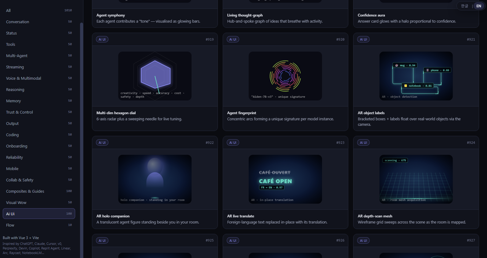

# ✨ AiUi — AI 에이전트 UX 갤러리

> **AI 네이티브 제품을 위한 살아있는 UX 패턴 카탈로그.**
> 19개 카테고리에 걸친 1,010개의 인터랙티브 패턴 프리뷰 — 모든 AI 팀이 결국 묻게 되는 질문에 답하기 위해 만들어졌습니다:
> *"이게 실제로 어떻게 보이고 어떻게 동작해야 하나?"*

*[🇺🇸 Read in English →](./README.md)*



---

## 왜 만들었나

에이전틱 앱을 만든다는 건 매주 UI 컨벤션을 다시 발명한다는 의미입니다. *토큰 스트리밍, 툴 호출 트레이스, 추론 표면, 멀티 에이전트 핸드오프, 메모리 패널, 신뢰 제어, 음성 + 멀티모달 입력* — 이런 것들에 대한 Bootstrap도, Material 명세도, "휴먼 인터페이스 가이드라인"도 없습니다. 모든 팀이 같은 프리미티브를 다시 발견하고 있고, 일관되지 않은 버전들을 출시하고 있습니다.

**AiUi**는 그 공백을 메우기 위한 *테스트베드*입니다. Figma 파일에서 단 하나의 디자인을 두고 논쟁하는 대신, 수백 개의 살아있는 변형을 나란히 렌더링합니다. 각각은 열어보고, 검토하고, 복사할 수 있는 독립적인 Vue 컴포넌트입니다.

목표:

- **레퍼런스이지 프레임워크가 아니다.** npm 패키지도, 강요되는 의견도 없습니다. 모든 패턴은 평범한 `.js` Vue 렌더 함수 모듈입니다 — 읽고, 포크하고, 버리세요.
- **깊이보다 너비.** 1,010개는 의도된 숫자입니다. 대부분은 당신의 제품에 맞지 않을 겁니다. 핵심은 *디자인 공간이 어떻게 생겼는지 보여주는 것* — 그러면 옳은 것이 명확해집니다.
- **현장에서 영감을 얻다.** ChatGPT, Cursor, v0, Perplexity, Devin, Copilot, Replit Agent, Linear, Arc, Raycast, NotebookLM 등 실시간으로 이 카테고리를 정의하고 있는 제품들에서 패턴을 가져옵니다.
- **빠르게 훑기.** 시각적 브라우징을 위한 그리드 뷰, 파워 유저를 위한 리스트 뷰, 이름 / 설명 / 카테고리 / 패턴 ID로 검색. 어떤 타일이든 열면 전체 라이브 화면과 영감 노트, 태그를 볼 수 있습니다.

AI 제품 UI를 디자인하거나 리뷰하는 사람이라면, 방향을 정하기 전에 마주서야 할 벽으로 만들어졌습니다.

---

## 무엇이 들어있나

**1,010개 패턴**이 **19개 카테고리**로 정리되어 있습니다:

| # | 카테고리 | 초점 |
|---|---|---|
| 01 | **Conversation** | 말풍선, 스레드, 인용, 메시지 단위 어포던스 |
| 02 | **Status** | 스피너, 진행률, 큐 가시성, 에이전트 상태 |
| 03 | **Tools** | 툴 호출 트레이스, 함수 프리뷰, 인스펙터 |
| 04 | **Multi-Agent** | 조율, 핸드오프, 역할 패널, 디베이트 |
| 05 | **Streaming** | 토큰 렌더링, 부분 UI, 낙관적 상태 |
| 06 | **Voice & Multimodal** | 마이크 어포던스, 비전 입력, 파일 드롭 |
| 07 | **Reasoning** | 사고 사슬 표면, 계획, 스크래치패드 |
| 08 | **Memory** | 장기 메모리 패널, 회상, 망각 제어 |
| 09 | **Trust & Control** | 권한, 확인, 되돌리기, 감사 |
| 10 | **Output** | 마크다운, 테이블, 차트, 코드, 아티팩트 |
| 11 | **Coding** | 디프, 파일 트리, 터미널, 린트 표면 |
| 12 | **Onboarding** | 첫 실행, 빈 상태, 데모 |
| 13 | **Reliability** | 에러, 재시도, 폴백, 오프라인 |
| 14 | **Mobile** | 터치 우선, 제스처, 컴팩트 밀도 |
| 15 | **Collab & Safety** | 멀티 유저, 콘텐츠 리뷰, 가드레일 |
| 16 | **Composites & Guides** | 결합된 화면, 워크스루 |
| 17 | **Visual Wow** | 모션, 깊이, 제너러티브 미학 |
| 18 | **Ai Ui** | 상상된 / 차원이 다른 에이전트 UX |
| 19 | **Flow** | 노드 기반 AI 플로우 에디터 (ReactFlow 스타일) |

모든 패턴은 카테고리, 짧은 설명, 긴 설명, 영감 목록, 태그, 그리고 완전히 인터랙티브한 컴포넌트 프리뷰를 가집니다.

---

## 컴포넌트 구성

코드베이스는 깔끔하게 **네 개의 레이어**로 나뉩니다: 셸(레이아웃 + 네비게이션), 인스펙터(모달 + 타일), 패턴 엔진(레지스트리 + 헬퍼 + 31개 모듈 파일), 지원 레이어(i18n + 스타일). 각 부분의 역할과 그 형태를 가진 이유를 아래에 설명합니다.

### 셸 레이어

#### `src/App.vue` — 레이아웃 & 네비게이션

단 하나의 최상위 컴포넌트입니다. 전체 페이지 크롬을 소유합니다: 280px 사이드바(브랜드, 검색, 카테고리 네비, 푸터 크레딧), 스크롤 가능한 메인 영역(헤더 + 그리드/리스트 뷰), 그리고 상단 우측 고정 언어 스위처. 모든 화면이 의존하는 네 개의 UI 상태 조각을 가집니다: `search`, `activeCategory`, `view` (`'grid' | 'list'`), 그리고 `openId`(현재 검토 중인 패턴). `filtered` computed는 이름 / 설명 / 카테고리 / 숫자 ID에 대해 검색을 실행하고, `counts`는 카테고리별 합계를 미리 계산하여 사이드바가 렌더링 중에 1,010개 전체 리스트를 순회하지 않도록 합니다. 키보드 네비게이션(← / → / Esc)은 윈도우 레벨에서 연결되어 어떤 패턴이 열려 있든 작동합니다.

#### `src/components/PatternCard.vue` — 그리드 타일

200px 높이의 프레임 안에 하나의 패턴 프리뷰를 렌더링하는 독립적인 버튼입니다. 각 타일은 패턴의 실제 컴포넌트를 `:preview="true"`로 마운트합니다 — 패턴은 그 prop이 설정되면 컴팩트 변형을 렌더링하도록 기대됩니다. 프리뷰 컨테이너의 `pointer-events: none`은 임베디드 인터랙티브 컴포넌트와의 중첩 클릭 충돌 없이 타일 전체를 클릭 가능하게 유지합니다. 호버 시 카드가 2px 떠오르고 테두리가 밝아집니다. 카테고리 칩과 `#NNN` ID는 상단 가장자리에 고정됩니다.

#### `src/components/PatternModal.vue` — 전체 화면 인스펙터

상세 뷰입니다. 어떤 타일이든 클릭하면 열립니다. 두 컬럼 레이아웃(`1fr 280px`) — 왼쪽에 라이브 화면(완전한 인터랙티브 컴포넌트, 프리뷰 스로틀링 없음), 오른쪽에 메타 사이드바(`소개`, `영감`, `태그`). 헤더는 이전 / 다음 / 닫기 버튼을 담고, 닫기는 배경 클릭과 Esc로도 발동됩니다. 800px보다 좁은 화면에서는 단일 컬럼으로 접혀 메타 사이드바가 라이브 화면 아래로 떨어집니다.

### 패턴 엔진

#### `src/patterns/registry.js` — 집계자

`patterns`와 `categories`의 단일 진실 공급원입니다. 모든 패턴 모듈을 정적으로 임포트하고(의도적입니다 — Vite가 사용하지 않는 부분을 트리 쉐이킹하고, 단일 임포트 그래프가 HMR을 빠르게 유지합니다), 하나의 정렬된 배열로 평탄화합니다. 부팅 시 콘솔에 로드 수를 기록(`[AiUx] patterns loaded: 1010 across 19 categories`)하여 어떤 모듈도 조용히 임포트에 실패하지 않았다는 sanity check 역할을 합니다.

#### `src/patterns/helpers.js` — 공유 렌더 유틸리티

48줄짜리 파일이 큰 일을 합니다. Vue 컴포지션 프리미티브를 재익스포트하여 패턴 모듈이 `'vue'`에서 50번 가져오는 대신 `import { ref, computed, ... } from './helpers'`로 가져올 수 있게 합니다. `injectCss(key, css)`를 제공합니다 — 1,010개의 `<style>` 블록을 필요로 하지 않고 각 패턴이 자체 스코프 스타일을 출하할 수 있게 하는 중복 제거 런타임 CSS 주입기입니다. 더불어 대부분의 패턴이 의존하는 스트리밍 / 애니메이션 효과를 위한 작은 컴포저블들(`useTypewriter`, `useInterval`, …)이 있습니다.

#### `src/patterns/0N-*.js` — 기본 패턴 모듈 (각 10개)

`01`부터 `10`까지 번호가 매겨진 파일은 각 카테고리의 원래 10개 패턴 — 표준적이고 가장 신중하게 고려된 변형 — 을 정의합니다. 각 파일은 패턴 객체 배열을 익스포트합니다: `{ id, name, category, shortDesc, longDesc, inspiration, tags, component }`. `component`는 보통 `setup()`이 렌더 함수를 반환하는 `defineComponent`입니다 — 렌더 함수는 파일별 별도 템플릿/스타일 컴파일이 없어 수백 개의 패턴으로 확장하기에 `.vue` SFC보다 낫습니다.

#### `src/patterns/0Nb-*-extra.js` — 확장 모듈 (각 40개)

`b` 접미사 파일은 동일한 10개 카테고리를 각각 40개의 변형으로 확장하여 원래 10개 카테고리를 각각 50개 패턴으로 늘립니다. 기본 세트가 단독으로 리뷰 가능하도록, 그리고 표준 예제를 어지럽히지 않고 엑스트라를 실험할 수 있도록 별도 파일로 유지됩니다.

#### `src/patterns/11-19-*.js` — 새로운 카테고리 모듈

카테고리 11–19 (`Coding`, `Onboarding`, `Reliability`, `Mobile`, `Collab & Safety`, `Composites & Guides`, `Visual Wow`, `Ai Ui`, `Flow`)는 갤러리의 범위가 커짐에 따라 점진적으로 추가되었습니다. `16-composites.js`가 327줄로 단일 파일 중 가장 큽니다 — 기존 프리미티브들을 엮어 "실제 제품 표면이 어떻게 생겼나"를 보여주는 다중 패널 목업을 만듭니다. `18-ai-imagined.js`는 사변적 계층입니다 — 아직 출시된 제품에 존재하지 않지만 이 분야가 가고 있는 방향처럼 느껴지는 패턴들입니다.

### 지원 레이어

#### `src/i18n/index.js` — 경량 i18n 컴포저블

약 50줄, 의존성 없음. 반응형 `locale` ref, 점 경로 해결과 `{placeholder}` 보간을 가진 `t(key, params)` 함수, `localStorage`에 영속화하고 `<html lang>`을 업데이트하는 `setLocale(code)` 뮤테이터, 그리고 상단 우측 스위처가 소비하는 `availableLocales` 배열을 반환하는 `useI18n()`을 익스포트합니다. 활성 로케일에서 키가 누락되면 기본 로케일로 폴백합니다.

#### `src/i18n/locales/{en,ko}.js`

화면 단위로 정리된 평면 JS 객체(`brand`, `search`, `nav`, `footer`, `header`, `empty`, `modal`, `category`)입니다. 카테고리는 표준 영어 이름으로 키가 매겨져 `App.vue`의 필터 로직이 원시 문자열 비교를 유지하면서 디스플레이는 번역된 값으로 렌더링할 수 있게 합니다.

#### `src/styles/global.css` — 디자인 토큰

핸드 롤드, Tailwind 등 프레임워크 없음. CSS 변수로 다크 테마를 정의합니다(`--bg`, `--bg-1..3`, `--line`, `--line-2`, `--text`, `--text-dim`, `--text-mute`, 액센트 팔레트, 그라데이션, 섀도우, radii, 모노스페이스 스택). `html`/`body`/`button`/`input` 기본 리셋 외에 패턴 모듈이 공유 스타일을 다시 선언하지 않고 사용할 수 있는 몇 가지 유틸리티 클래스(`.row`, `.chip`, `.dim`, `.mono`, `.mute`, `.surface`)도 있습니다.

### 엔트리 & 빌드

#### `src/main.js`

세 줄. Vue 앱을 만들고, `#app`에 마운트하고, 글로벌 스타일시트를 임포트합니다. 라우터 없음(단일 페이지 갤러리), Pinia 없음(`ref`/`computed`로 충분), 플러그인 등록 없음.

#### `index.html`

표준 Vite 엔트리. SVG 파비콘(✨ 이모지)을 인라인하여 추가 자산 요청이 없습니다.

#### `vite.config.js`

`base: '/aiux/'`와 들어오는 요청에 `/aiux/` 접두사를 다시 붙이는 작은 미들웨어를 설정합니다. 이로써 단일 Vite 인스턴스가 직접 접근(`localhost:27777`)과 nginx 뒤에서 `/aiux/`로 리버스 프록시되는 경우 모두에 올바르게 서비스합니다 — 직접 접근 시 Vite의 빌트인 리디렉트가 주소창을 바꾸지 않도록 합니다.

---

## 기술 스택

- **Vue 3** (`<script setup>`, Composition API) — 셸은 SFC, 1,010개 패턴 모듈은 렌더 함수 (대규모에서 작성 속도가 빠름)
- **Vite 6** — 개발 + 빌드
- **커스텀 경량 i18n** — `vue-i18n` 의존성 없음; 반응형 로케일 ref + localStorage 영속화를 갖춘 약 50줄 컴포저블
- **CSS 프레임워크 없음** — `src/styles/global.css`에 손으로 작성한 토큰
- **상태 라이브러리 없음** — `ref` / `computed`만

개발 서버는 **포트 27777**에서 실행되며 `/aiux/`로 리버스 프록시될 수 있습니다.

---

## 실행 방법

```bash
npm install
npm run dev      # http://localhost:27777
npm run build    # 프로덕션 빌드 → dist/
npm run preview  # 빌드된 번들 프리뷰
```

Windows에서는 `run.bat`이 `npm run dev`의 한 줄 단축입니다.

---

## 프로젝트 구조

```
src/
├── App.vue                       # 레이아웃 셸, 사이드바, 헤더, 언어 스위처
├── main.js                       # createApp + mount
├── components/
│   ├── PatternCard.vue           # 그리드 타일 (프리뷰 + 메타)
│   └── PatternModal.vue          # 전체 화면 인스펙터
├── i18n/
│   ├── index.js                  # useI18n 컴포저블
│   └── locales/
│       ├── en.js
│       └── ko.js
├── patterns/
│   ├── registry.js               # 모든 카테고리 집계
│   ├── helpers.js                # 공유 렌더 헬퍼
│   ├── 01-conversation.js        # 기본 10개
│   ├── 01b-conversation-extra.js # +40개 엑스트라
│   ├── …                         # 31개 패턴 모듈
│   └── 19-flow.js
└── styles/
    └── global.css                # 토큰 + 기본 스타일
```

---

## 상태 & 로드맵

이것은 **테스트베드**이지 제품이 아닙니다. 예상하세요:

- 일부 패턴은 스케치이며 프로덕션 컴포넌트가 아닙니다
- 시각적 마감은 의도적으로 고르지 않습니다 — 각 타일을 완성하는 것보다 공간을 탐색하는 것이 중요합니다
- 에이전트 UX 분야가 진화함에 따라 카테고리는 계속 늘어납니다

기여 환영, 특히:

- 새로운 패턴 모듈 (`0N-*.js` 어느 것이든 그 형태를 따르세요)
- 더 많은 로케일 (일본어, 중국어, 독일어, …)
- 각 타일의 "CodeSandbox에서 포크" 버튼
- 카테고리 필터링에 더한 태그 기반 필터링

---

## 라이선스

개인 탐구 / 레퍼런스 프로젝트. 자신의 작업에서 어떤 패턴이든 시작 코드로 사용하세요 — 출처 표기는 환영이지만 필수는 아닙니다.

---

*Vue 3 + Vite로 제작. ChatGPT, Cursor, v0, Perplexity, Devin, Copilot, Replit Agent, Linear, Arc, Raycast, NotebookLM에서 영감을 얻음…*
